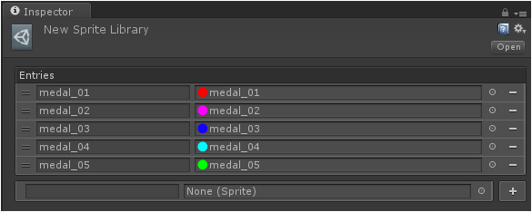

# unity3d-ordered-dictionary

[](https://badge.fury.io/js/%40rotorz%2Funity3d-ordered-dictionary)
[](https://david-dm.org/rotorz/unity3d-ordered-dictionary)
[](https://david-dm.org/rotorz/unity3d-ordered-dictionary#info=devDependencies)

Library for adding ordered dictionaries to custom `ScriptableObject` and `MonoBehaviour`
classes in a way that can be serialized by Unity provided that the key and value types
are serializable.


```sh
$ npm install --save @rotorz/unity3d-ordered-dictionary
```

This package is compatible with [unity3d-package-syncer](https://github.com/rotorz/unity3d-package-syncer).




## Features

- Default inspector with intuitive interface.
- Drop insertion for UnityEngine.Object's where name is used for key.
- Have multiple dictionaries per `ScriptableObject` or `MonoBehaviour`!
- Serializable dictionary asset files.
- Supports any serializable key and value types.
- Ordered dictionary.


## Installation

The **unity3d-ordered-dictionary** library is designed to be installed into Unity projects
using the **npm** package manager and then synchronized into the "Assets" directory using
the **unity3d-package-syncer** utility. For more information regarding this workflow refer
to the [unity3d-package-syncer](https://github.com/rotorz/unity3d-package-syncer)
repository.

Alternatively you can download the contents of this repository and add directly into your
project, but you would also need to download the sources of other packages that this
package is dependant upon. Refer to the `packages.json` file to see these.


## Boilerplate Generation Tool

This is a simple client side (offline) tool that runs to quickly generate the boilerplate
that Unity needs to make the Ordered Dictionary for Unity library work since Unity doesn't
currently support serialization with generic types:

http://rotorz.com/unity/misc/ordered-dictionary-boilerplate


## A couple of examples!

### Sprite Library

```csharp
// StringSpriteDictionaryEditable.cs
using Rotorz.Games.Collections;
using System;
using UnityEngine;

// Script filename must match this class.
public sealed class StringSpriteDictionaryEditable : EditableEntry<StringSpriteDictionary>
{
}

// This class can exist in same file with any name.
[Serializable, EditableEntry(typeof(StringSpriteDictionaryEditable))]
public sealed class StringSpriteDictionary : OrderedDictionary<string, Sprite>
{
}


// SpriteLibrary.cs
using UnityEditor;
using UnityEngine;

[CreateAssetMenu]
public class SpriteLibrary : ScriptableObject
{
	public StringSpriteDictionary sprites;
}
```


### String Lookup Table


```csharp
// StringStringDictionaryEditable.cs
using Rotorz.Games.Collections;
using System;
using UnityEngine;

// Script filename must match this class.
public sealed class StringStringDictionaryEditable : EditableEntry<StringStringDictionary>
{
}

// This class can exist in same file with any name.
[Serializable, EditableEntry(typeof(StringStringDictionaryEditable))]
public sealed class StringStringDictionary : OrderedDictionary<string, string>
{
}


// AchievementNamesBehaviour.cs
using UnityEditor;
using UnityEngine;

public class AchievementNamesBehaviour : MonoBehaviour
{
	public StringStringDictionary names;
}
```


## Contribution Agreement

This project is licensed under the MIT license (see LICENSE). To be in the best
position to enforce these licenses the copyright status of this project needs to
be as simple as possible. To achieve this the following terms and conditions
must be met:

- All contributed content (including but not limited to source code, text,
  image, videos, bug reports, suggestions, ideas, etc.) must be the
  contributors own work.

- The contributor disclaims all copyright and accepts that their contributed
  content will be released to the public domain.

- The act of submitting a contribution indicates that the contributor agrees
  with this agreement. This includes (but is not limited to) pull requests, issues,
  tickets, e-mails, newsgroups, blogs, forums, etc.
